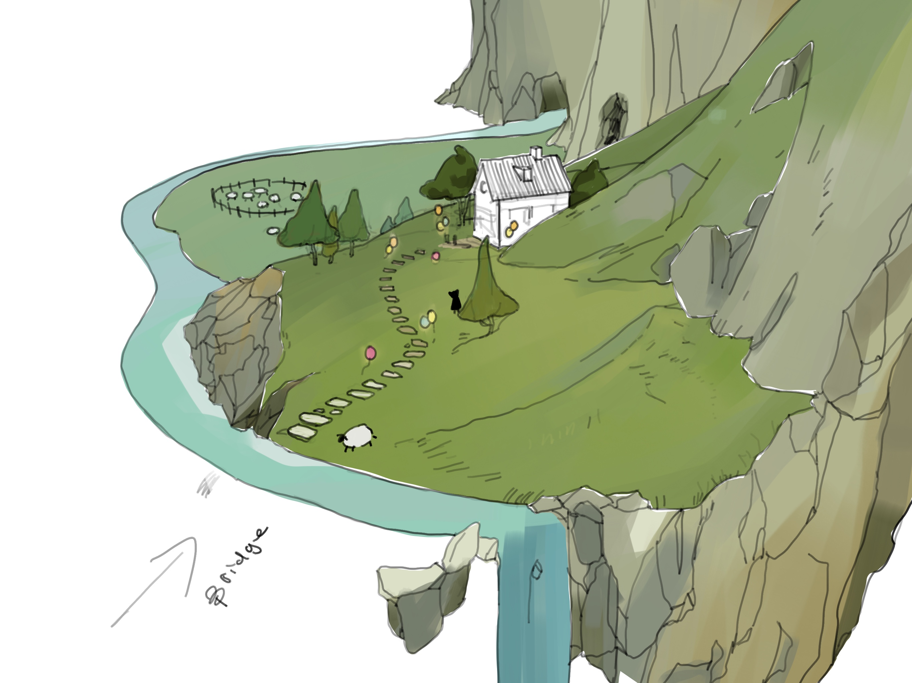
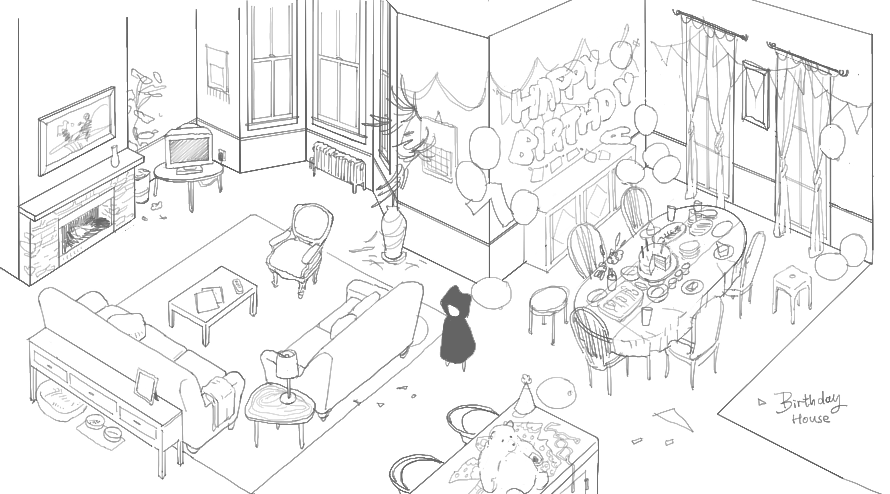
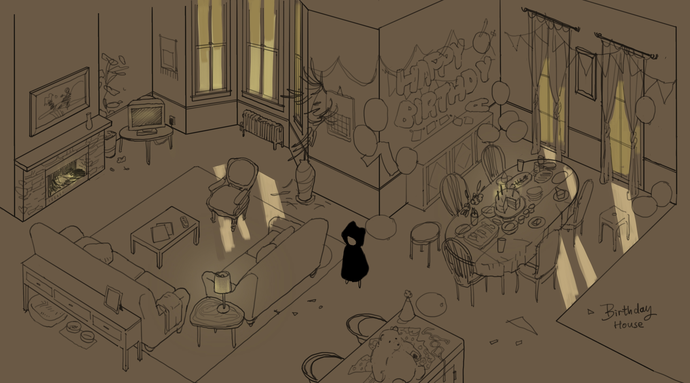

# Solura Cliffs

A large, open area with imposing cliffs, dotted with houses built into the rock. The Solura Cliffs is the second area of the Solura Valley, and is where the player can find the sewing kit to repair the Svartskogen, and an optional side quest to find all the sheep.

Enemies hide amongst trees along the path to the cliffs, and the player can find the second enemy type, the Eyeball, in the area. Within the cliff houses are scenes of Nilo's past, and the main house will show a scene of Nilo's birthday party, where only the Fellow Dreamer showed up.

The Solura Cliffs is also where the player can find the sewing kit to repair the Svartskogen, and an optional side quest to find all the sheep. The sheep are scattered around the area, and are hidden in various places.

A strange cave at the edge of the cliffs is blocked by a shadow-type enemy, unable to be damaged by the umbrella. A light-based weapon from Level 2 is needed to explore this side area.

The player can also use a grappling hook, found later in the game, to explore reach the top of the cliffs and explore a hidden area.

## Gallery

